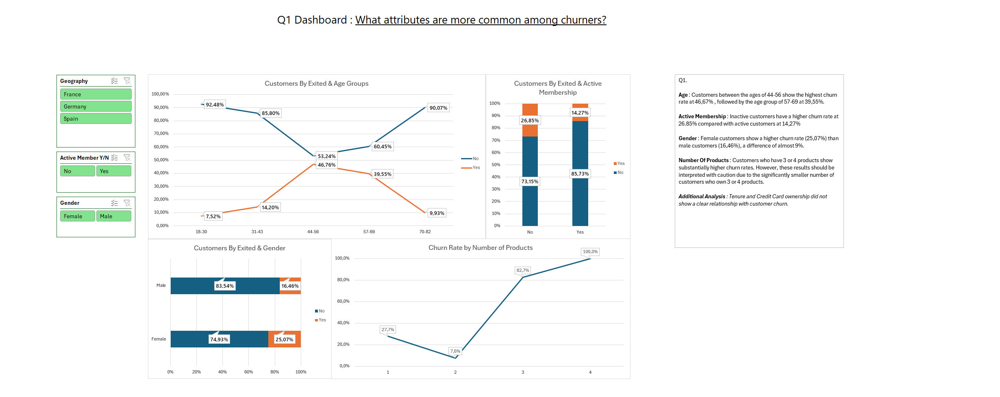
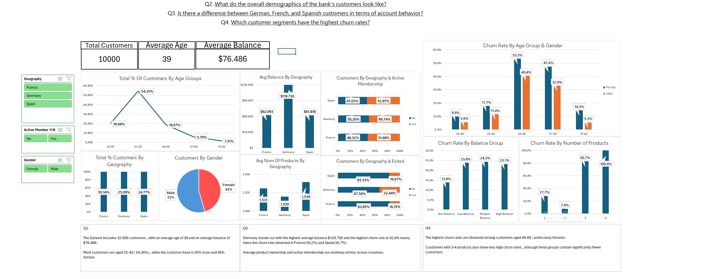

# Bank Customer Churn Analysis

## Project Overview

This project analyzes a dataset of 10,000 bank customers to identify patterns and customer characteristics associated with churn.

The analysis was performed in Microsoft Excel, using Power Query for data preparation and PivotTables, PivotCharts, and slicers for analysis and interactive visualization.

## Business Questions

The analysis focuses on four main questions:

1. What attributes are more common among churned customers?
2. What do the overall demographics of the bank's customers look like?
3. Are there differences between customers in France, Germany, and Spain in terms of account behavior?
4. Which customer segments have the highest churn rates?

## Tools Used

- Microsoft Excel
- Power Query
- PivotTables
- PivotCharts
- Slicers
- Data Cleaning & Transformation
- Data Analysis
- Data Visualization

## Key Findings

- Customers aged 44–69 show the highest churn rates, particularly female customers.
- Inactive customers have a higher churn rate than active customers.
- Germany has the highest churn rate at approximately 32.4%, compared with approximately 16% in France and Spain.
- German customers also have the highest average balance at approximately $119.7K.
- Customers with 3 or 4 products show substantially higher churn rates; however, these groups contain significantly fewer customers.
- Tenure and credit card ownership did not show a clear relationship with customer churn.

## Dashboard Preview

### Customer Churn Dashboard

### Customer Demographics, Geography & Segments Dashboard

